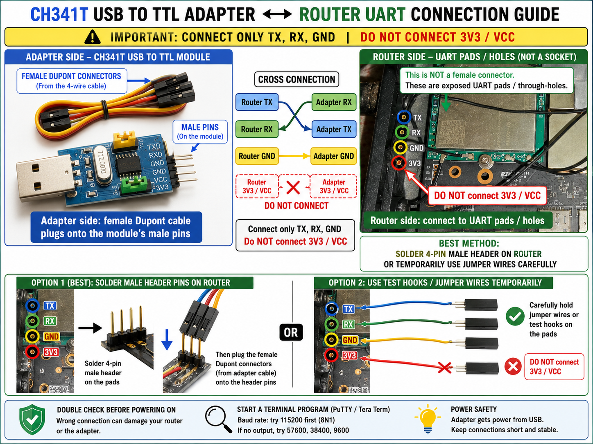
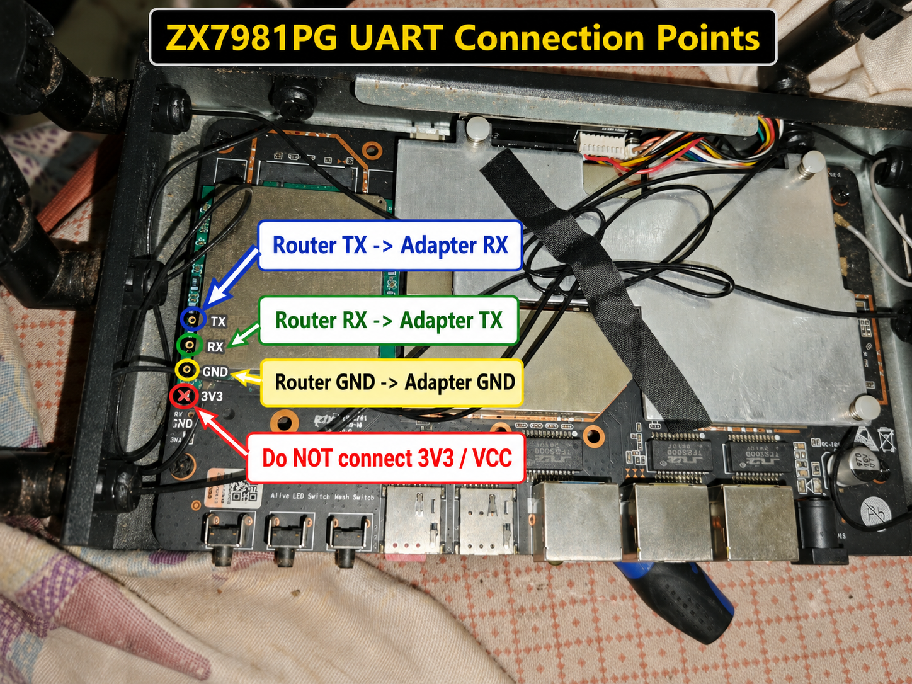
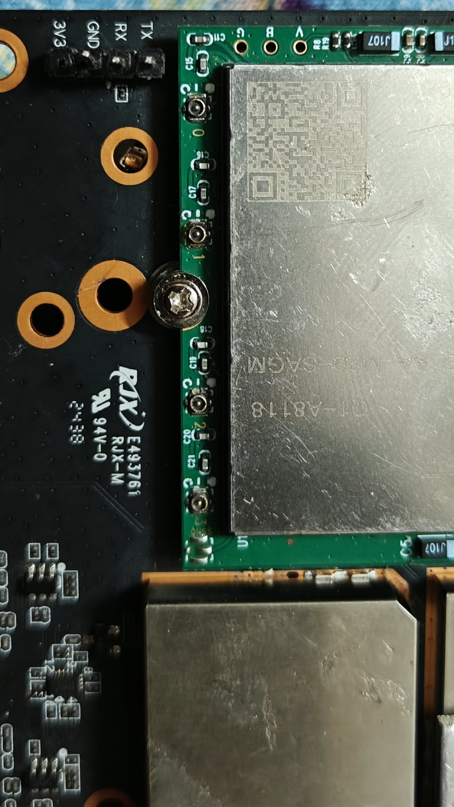
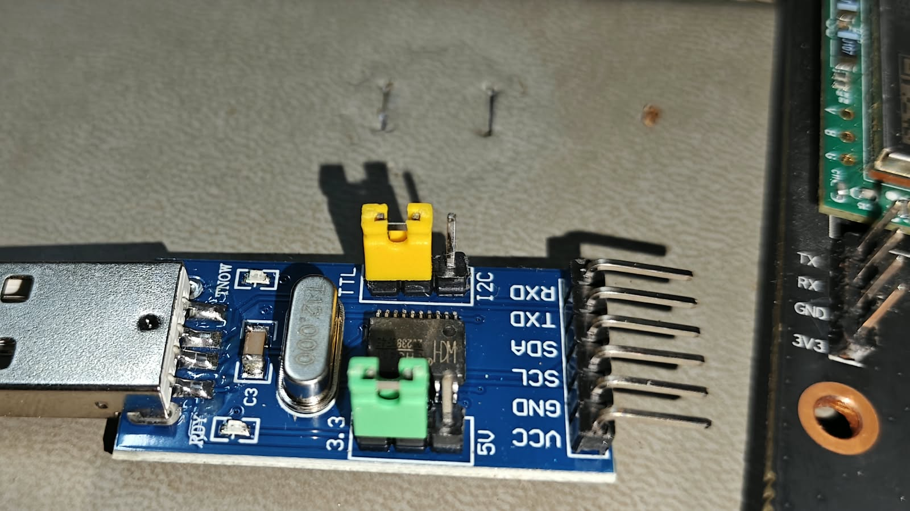
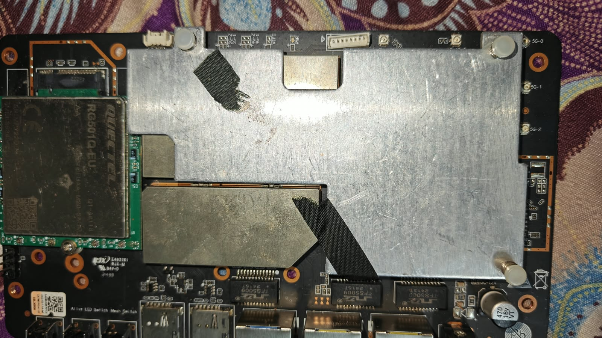

# ZX7981PG UART and TFTP Recovery Guide

This repository documents the recovery procedure successfully used on a **ZX7981PG** router with a **MediaTek MT7981** platform and MediaTek U-Boot.

The router was recovered through the UART console by loading the original firmware from a Windows PC over TFTP and running:

```text
mtkupgrade fw
```

> [!CAUTION]
> This is a device-specific recovery record, not a universal OpenWrt flashing guide. Use only a firmware image verified for the exact ZX7981PG hardware revision. A wrong image or bootloader operation can permanently brick the router or erase factory RF calibration data.

## Tested recovery values

| Item | Successfully used value |
|---|---|
| UART settings | `115200 baud`, `8 data bits`, `no parity`, `1 stop bit`, `no flow control` |
| U-Boot prompt | `MT7981>` |
| Router U-Boot IP | `192.168.2.1` |
| Windows PC / TFTP IP | `192.168.2.88/24` |
| Netmask | `255.255.255.0` |
| Load address | `0x46000000` |
| Tested firmware filename | `ZX7981PG-9.6.1-260730-143345-sysupgrade.bin` |
| Tested transferred size | `19,857,408 bytes` / `0x12f0000` |
| Upgrade path | `mtkupgrade fw` |
| Post-recovery management IP | `192.168.88.1` |

The filename above identifies the image used in this particular successful recovery. **Do not assume that a file is compatible merely because it has the same name.** Preserve a known-good copy and its SHA-256 checksum.

## What you need

- ZX7981PG router and its normal power adapter
- A **3.3 V TTL UART** adapter
- Three UART wires for TX, RX and GND
- Windows PC with an Ethernet port
- Ethernet cable
- PuTTY, Tera Term or another serial terminal
- A TFTP server such as Tftpd64/Tftpd32
- A verified original firmware image for the exact router revision

## UART wiring

Connect the UART while the router is powered off.

| Router UART pin | USB TTL adapter | Note |
|---|---|---|
| `TX` | `RX` | Cross-connect |
| `RX` | `TX` | Cross-connect |
| `GND` | `GND` | Common ground |
| `3V3` / `VCC` | **Do not connect** | Power the router with its own adapter |

> [!WARNING]
> Never connect the adapter's `5V` pin to the router UART header. Do not connect UART `VCC` at all for this procedure. Only TX, RX and GND are required.

### Connection diagram

The following diagram shows both sides of the connection. The router points are exposed UART pads/holes, not a ready-made female socket. Soldering a small header is the most reliable method; temporary test hooks may also be used carefully.



### UART points on the ZX7981PG board

Use the board markings themselves as the final reference. From top to bottom in this photo, the pads are `TX`, `RX`, `GND` and `3V3`. Connect only the first three as shown; leave `3V3` disconnected.



<details>
<summary>Open the original close-up and hardware reference photos</summary>

Router UART labels and pads:



Example CH341T USB-to-TTL adapter. Use its `TXD`, `RXD` and `GND` pins only; do not connect `VCC` or `3V3` to the router:



ZX7981PG board overview showing the modem and antenna connector area:



</details>

## Step 1 - Preserve and verify the firmware

Put the verified firmware in a dedicated folder that will become the TFTP server root.

The file used in the successful recovery was:

```text
ZX7981PG-9.6.1-260730-143345-sysupgrade.bin
```

Record its SHA-256 checksum in Windows PowerShell:

```powershell
Get-FileHash ".\ZX7981PG-9.6.1-260730-143345-sysupgrade.bin" -Algorithm SHA256
```

Keep the checksum with the firmware. If a future file produces a different checksum, stop and verify its source and hardware compatibility before flashing.

## Step 2 - Configure the Windows Ethernet address

Temporarily configure the PC Ethernet adapter as follows:

| Setting | Value |
|---|---|
| IPv4 address | `192.168.2.88` |
| Subnet prefix | `/24` |
| Subnet mask | `255.255.255.0` |
| Default gateway | Leave blank |
| DNS | Leave blank |

It is helpful to disable Wi-Fi temporarily so Windows does not select an unexpected network route.

Confirm the address in PowerShell:

```powershell
Get-NetIPAddress -AddressFamily IPv4 |
    Format-Table InterfaceAlias,IPAddress,PrefixLength
```

The Ethernet row should show `192.168.2.88` with prefix length `24`.

## Step 3 - Start the TFTP server

1. Select the folder containing the firmware as the TFTP root/current directory.
2. Bind the TFTP server to the Ethernet interface at `192.168.2.88`.
3. Allow the TFTP server through Windows Firewall on the private network when prompted.
4. Connect the PC directly to a router LAN port with Ethernet.

Do not begin the flash until U-Boot can ping the PC.

## Step 4 - Open the UART console

1. With router power off, connect TX to RX, RX to TX and GND to GND.
2. Connect the USB TTL adapter to the Windows PC.
3. Find its COM port in Windows Device Manager.
4. Open the COM port using these settings:

```text
Speed:       115200
Data bits:   8
Parity:      None
Stop bits:   1
Flow control: None
```

If the terminal displays unreadable characters, recheck the baud rate, ground and UART logic level. If nothing appears, recheck the COM port and swap TX/RX.

## Step 5 - Stop autoboot and enter U-Boot

Keep the serial terminal focused and power on the router. Press a key during the short boot countdown.

A successful interruption leaves this prompt:

```text
MT7981>
```

If Linux starts instead, reboot and press a key earlier during the U-Boot countdown.

## Step 6 - Verify TFTP connectivity before writing

At the `MT7981>` prompt, run:

```text
ping 192.168.2.88
```

Expected result:

```text
Using ethernet@15100000 device
host 192.168.2.88 is alive
```

If the host is not alive, **do not start the upgrade**. Check:

- PC Ethernet is exactly `192.168.2.88/24`
- Ethernet cable and router LAN port
- TFTP server is bound to `192.168.2.88`
- Windows Firewall permission
- Wi-Fi or VPN is not interfering with routing

## Step 7 - Start only the firmware upgrade path

At the U-Boot prompt, run:

```text
mtkupgrade fw
```

If you use the interactive MediaTek boot menu instead, choose **Upgrade firmware**. The environment displayed this mapping:

```text
Upgrade firmware = mtkupgrade fw
```

Do **not** select BL2, FIP or single-image upgrade for this recovery.

The utility may ask:

```text
Run image after upgrading? (Y/n):
```

You may accept the default or answer `n` and boot manually after the completion message. If U-Boot returns to `MT7981>` after the upgrade, use `reset` as described below.

For the load-source selection, the successful session used:

```text
Select (enter for default): 0
```

Then enter these values when prompted:

```text
Input U-Boot's IP address: 192.168.2.1
Input TFTP server's IP address: 192.168.2.88
Input IP netmask: 255.255.255.0
Input file name: ZX7981PG-9.6.1-260730-143345-sysupgrade.bin
```

## Step 8 - Watch the transfer and verification

The beginning of a correct transfer should resemble:

```text
Using ethernet@15100000 device
TFTP from server 192.168.2.88; our IP address is 192.168.2.1
Filename 'ZX7981PG-9.6.1-260730-143345-sysupgrade.bin'.
Load address: 0x46000000
Loading: ...
done
Bytes transferred = 19857408 (12f0000 hex)
```

For the tested image, the transfer must report:

```text
19857408 bytes (0x12f0000)
```

> [!IMPORTANT]
> Do not disconnect power, Ethernet or UART while erase, write or verification is running. If the transferred size differs from the known-good image, stop before allowing a write and verify the file.

The successful upgrade then erased, wrote and verified both firmware areas:

```text
*** upgrade ubi ***
Erasing ... OK
Writing ... OK
Verifying ... OK

*** upgrade ubi2 ***
Erasing ... OK
Writing ... OK
Verifying ... OK

*** Firmware upgrade completed! ***
```

Proceed only after the exact completion message appears and all write/verify operations report `OK`.

## Step 9 - Boot the recovered firmware

If the router does not boot automatically and returns to the U-Boot prompt, run:

```text
reset
```

The environment also provides `mtkboardboot` for normal board boot, but `reset` is the simplest way to restart after a completed flash.

Give the first boot extra time. Do not interrupt power during the first boot.

A successful boot displays the OpenWrt banner and BusyBox shell over UART. The tested recovery booted:

```text
OpenWrt 21.02-SNAPSHOT, 9.6.1
```

## Step 10 - Restore Windows networking and verify access

Return the Windows Ethernet adapter to DHCP/automatic addressing. Then test the router's management address:

```powershell
ping 192.168.88.1
ssh root@192.168.88.1
```

After a factory reflash, SSH can show:

```text
WARNING: REMOTE HOST IDENTIFICATION HAS CHANGED!
```

Only after confirming that `192.168.88.1` is the same directly connected router, remove the old cached key and reconnect:

```powershell
ssh-keygen -R 192.168.88.1
ssh root@192.168.88.1
```

## Options that must not be used

The following commands were **not needed** for the successful recovery:

| Option | Risk |
|---|---|
| `mtkupgrade bl2` | A wrong BL2 can prevent U-Boot from starting |
| `mtkupgrade fip` | Replaces bootloader components and is unnecessary for a normal firmware recovery |
| `mtkupgrade simg` | Requires an image built for the exact single-image layout |
| `erase`, `nand erase`, raw `mtd write` | Can destroy the U-Boot environment, factory data, MAC addresses or RF calibration |

Use only:

```text
mtkupgrade fw
```

with an image verified for this hardware.

## Troubleshooting

| Problem | Safe checks |
|---|---|
| No UART text | Verify COM port, `115200 8N1`, GND, crossed TX/RX and 3.3 V logic |
| Garbled UART output | Recheck baud rate and ground |
| Cannot interrupt boot | Focus the terminal and repeatedly press a key during the countdown |
| U-Boot cannot ping PC | Recheck `192.168.2.88/24`, cable, LAN port and firewall |
| TFTP timeout | Recheck TFTP root, exact filename, interface binding and firewall |
| Wrong transferred size | Stop and verify the firmware file and checksum |
| Write or verify error | Do not run raw erase commands or repeatedly reboot; save the full UART log |
| Router boots but web UI is unavailable | Wait for first boot, return PC to DHCP and check `192.168.88.1` over ping/SSH |

## Keep a recovery kit

Store the following files together offline:

- Verified original firmware
- SHA-256 checksum of that exact file
- This README
- Screenshot of the working TFTP server settings
- Clear photo of the router UART pin labels
- USB TTL driver and terminal software
- Complete UART log from the successful recovery

Do not rename a different image to the old verified filename without updating its checksum and this recovery record.

## Scope and responsibility

This procedure records one successful ZX7981PG recovery. Hardware revisions and flash layouts can differ even when the product name looks the same. Verify the board, firmware source, file size and checksum before writing flash. You perform hardware access and flashing at your own risk.

